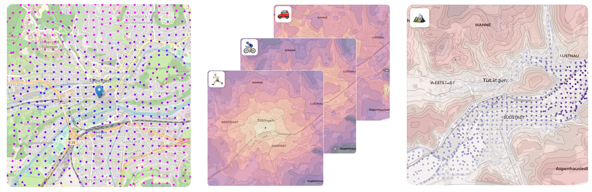

# Isochron Map Generator

> Featuring an example for the region Tübingen, Germany and a Regressor



An ischron map is an elegant tool to visualize how long one would travel starting from an origin to every sorounding destinations. 
It is helpfull to grasp how travel time changes by means of transportation but can also be used to see how transportation time changes during different times of day.
This project features a full pipline to collect the data, visualize the data points, plot the isochronmap and additionally train a regression model for aquired data.
In the following and the source code we use this pipeline on the region Tübingen Germany, but one can use this pipeline on any region. 


## Contents
In order to understand how the pipeline is structured you can simply look at the following jupyter notebooks, which will comment on how to aquire, save, load and plot the data, generate an isochrone map and train the regressor.
```
.
├── 01_RegionMapper.ipynb            # Collect samples in a region by querying the Google APIs
│
├── 02_RegionDisplayer.ipynb         # Plot samples collected and generate the correspondin isochrone maps
│
├── 03_DataAggregation.ipynb         # Load the data and store it into a pandas csv format
│
├── 04_RegressionAnalyisis.ipynb     # ???
│
└── 05_RegressionPlots.ipynb         # ???
```

The following directories and files provide the code structure and data for the python notebooks aboth. If you want to dive deeper and modify scripts presented in the notebooks or reuse data we already collected you will find them in these directories.
```
.
├── data                             # Collected datasets
│   ├── bicycling.json                 # Tübingen Bicycling data sampled from Google Directions API
│   ├── driving.json                   # Tübingen Driving data sampled from Google Directions API
│   ├── walking.json                   # Tübingen Walking data sampled from Google Directions API
│   ├── elevation.json                 # Tübingen Elevation data sampled from Google Elevation API
│   ├── combined_data.csv              # ???
│   └── combined_data_residuals.csv    # ???
│
├── maps                             # Interactive maps
│   ├── bicycling.html                 # Tübingen sample map for bicycling 
│   ├── driving.html                   # Tübingen sample map for driving 
│   ├── elevation.html                 # Tübingen sample map for elevation 
│   └── walking.html                   # Tübingen sample map for walking 
│
├── models                           # Trained regression models 
│   ├── fit_combi.pickle               # ???
│   ├── fit_combi_abs.pickle           # ???
│   ├── fit_horiz.pickle               # ???
│   └── fit_vertic.pickle              # ???
│
├── plots                            # Created Plots
│   ├── interpolation_maps             # Plots of interpolation maps
│   ├── horizontal_model               # Plots of horizontal regression model
│   ├── simple_combined_model          # Plots of simple combined regression model
│   └── extended_combined_model        # Plots of extended combined regression model
│ 
└── src                              # Source code for data agregation and visualization
    ├── RegionElevatioDisplayer        # Plot samples and interpolation for elevation
    ├── RegionElevationMapper          # Queries the Google Elevation API
    ├── RegionTimeDistanceDisplayer    # Plot samples and isochrone map for transportation types
    └── RegionTimeDistanceMapper       # Queries the Google Direction API
```

## Contributer
Frederic Becker - [fredeee](https://github.com/fredeee) \
Jan-Niklas Dihmann – [JDihlmann](https://github.com/JDihlmann)

## Misc
This project was part of the Data Literacy lecture WS 21/22 held by [Prof. Henning][prof]. 
It includes parts of the lecture in a practical fashion, such as data collection, data processing, data visualisation, data intpretation, data estimation and hypothesis testing.
Big thanks to Nicholas Krämer for creating the [Tueplots][tueplots] libary, which helps to find better matplotlib settings. We got inspired to conduct this project by the reddit post [[OC] Minimum travel time from Paris by train & bike and comparison to car][reddit]. Feel free to fork, this is a non commercial students project.


<!-- Markdown link & img dfn's -->
[prof]: https://uni-tuebingen.de/fakultaeten/mathematisch-naturwissenschaftliche-fakultaet/fachbereiche/informatik/lehrstuehle/methoden-des-maschinellen-lernens/personen/philipp-hennig/
[tueplots]: https://github.com/pnkraemer/tueplots
[reddit]: https://www.reddit.com/r/dataisbeautiful/comments/q7weml/oc_minimum_travel_time_from_paris_by_train_bike/hglcwjo/
